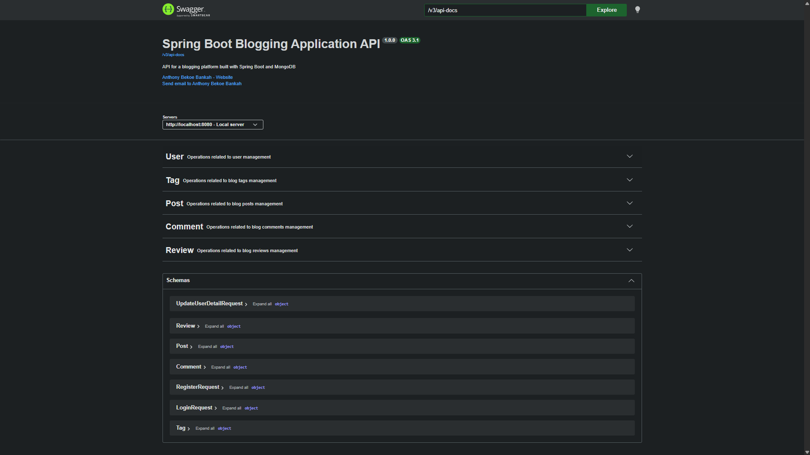

# 🍃 Spring Boot Blogging App

[](https://www.oracle.com/java/)
[](https://spring.io/projects/spring-boot)
[](https://spring.io/projects/spring-security)
[](https://www.mongodb.com/)
[](https://maven.apache.org/)

A production-ready RESTful and GraphQL API for a blogging platform built with Spring Boot. This project showcases clean layered architecture, JWT-based authentication, Google OAuth2 login, Role-Based Access Control (RBAC), and full CRUD functionality for posts, comments, tags, and reviews.

---

## ✨ Features

### 🔐 Security
*   **JWT Authentication:** Stateless login with signed access and refresh tokens (HMAC-SHA256).
*   **Google OAuth2 Login:** One-click sign-in via Google; user profile auto-persisted with role assignment.
*   **Role-Based Access Control (RBAC):** Three roles — `ADMIN`, `AUTHOR`, `READER` — enforced via `@PreAuthorize`.
*   **Token Blacklisting:** Logout invalidates tokens immediately using an in-memory `ConcurrentHashMap`.
*   **Session Tracking:** Active sessions tracked per user with IP address metadata.
*   **Brute-Force Protection:** Account locked for 15 minutes after 5 consecutive failed login attempts.
*   **Security Audit Logging:** All auth events (login, logout, token blacklist, brute-force) recorded and queryable.
*   **BCrypt Password Hashing:** Passwords stored with BCrypt strength 12.
*   **CORS Configuration:** Whitelisted origins for React/Angular frontends and local dev.
*   **CSRF:** Disabled for stateless JWT APIs (see [CORS.md](CORS.md) for full explanation).

### 📝 Content
*   **Post Management:** Full CRUD for blog posts with pagination, sorting, and filtering.
*   **Commenting:** Nested comments on posts.
*   **Tagging:** Categorise posts with tags.
*   **Review Management:** Star-rated reviews per post with average-rating endpoint.
*   **User Management:** Profile management and password update.

### ⚙️ Platform
*   **GraphQL API:** Queries and mutations available alongside REST.
*   **Caffeine Cache:** Application-level caching for posts, comments, reviews, tags, and users.
*   **AOP Logging & Performance Monitoring:** Method-level logging and execution-time tracking.
*   **OpenAPI / Swagger UI:** Interactive API documentation with Bearer token support.
*   **Input Validation:** Bean Validation with meaningful error messages.
*   **Layered Architecture:** Clear separation using the service layer pattern.

---

## 🛠️ Tech Stack

*   **Java 21**
*   **Spring Boot 3.2.1**
*   **Spring Security 6** — filter chain, method security, `BCryptPasswordEncoder`
*   **Spring Security OAuth2 Client** — Google login integration
*   **JJWT (io.jsonwebtoken)** — JWT generation and validation (HMAC-SHA256)
*   **Spring Data MongoDB** — document persistence
*   **Spring Boot Validation** — Bean Validation (JSR-380)
*   **Spring Boot Cache + Caffeine** — application-level caching
*   **Spring Boot AOP** — cross-cutting logging and performance concerns
*   **Spring for GraphQL** — GraphQL API
*   **SpringDoc OpenAPI 2** — Swagger UI with Bearer token support
*   **jBCrypt** — standalone BCrypt utility
*   **MongoDB** (running on `localhost:27017`)
*   **Maven**

---

## 📋 Prerequisites

Ensure the following are installed and running:

*   ☕ **Java 21+**
*   🍃 **MongoDB** (running on `localhost:27017`)
*   🔨 **Maven 3.6+**
*   🖥️ **IDE** (IntelliJ IDEA, Eclipse, or VS Code)
*   🔑 **Google OAuth2 credentials** (Client ID & Secret) — required for Google login only

---

## 🚀 Getting Started

### 1️⃣ Clone the Repository

```bash
git clone https://github.com/bankah-junior/SpringBootBloggingApp.git
cd SpringBootBloggingApp
```

### 2️⃣ Configure Environment Variables

Create an `application.yml` or set the following environment variables (see `.env.example`):

```yaml
app:
  jwt:
    secret: <your-256-bit-secret-key>        # min 32 characters
    expiration-ms: 86400000                  # 24 hours
    refresh-expiration-ms: 604800000         # 7 days
  oauth2:
    success-redirect-url: http://localhost:3000/oauth2/callback

spring:
  security:
    oauth2:
      client:
        registration:
          google:
            client-id: <your-google-client-id>
            client-secret: <your-google-client-secret>
            scope: email, profile
```

### 3️⃣ Start MongoDB

Ensure your MongoDB instance is running locally.

### 4️⃣ Build and Run the Application

```bash
mvn clean install
mvn spring-boot:run
```

The application will be available at:
👉 **[http://localhost:8080](http://localhost:8080)**

---

## 📡 REST API Endpoints

> 🔓 **Public** — no token required  
> 🔒 **Authenticated** — requires `Authorization: Bearer <token>`  
> 🛡️ **Role-restricted** — requires a specific role

### 🔐 Authentication

| Method | Endpoint | Access | Description |
|--------|----------|--------|-------------|
| `POST` | `/auth/register` | 🔓 Public | Register a new user (default role: `READER`) |
| `POST` | `/auth/login` | 🔓 Public | Login — returns `accessToken` + `refreshToken` |
| `POST` | `/auth/refresh` | 🔓 Public | Issue new tokens using a valid refresh token |
| `GET`  | `/auth/validate` | 🔒 Authenticated | Validate the current token |
| `POST` | `/auth/logout` | 🔒 Authenticated | Blacklist token and invalidate session |

### 👤 User Management

| Method | Endpoint | Access | Description |
|--------|----------|--------|-------------|
| `POST` | `/api/v1/users/register` | 🔓 Public | Create a new user |
| `POST` | `/api/v1/users/login` | 🔓 Public | Login a user |
| `GET`  | `/api/v1/users` | 🔓 Public | Retrieve all users |
| `GET`  | `/api/v1/users/{id}` | 🔓 Public | Retrieve user by ID |
| `PUT`  | `/api/v1/users/{id}` | 🔒 Authenticated | Update an existing user |
| `DELETE` | `/api/v1/users/{id}` | 🔒 Authenticated | Delete a user |
| `PUT`  | `/api/v1/users/update-password` | 🔒 Authenticated | Update user password |

### 📝 Post Management

| Method | Endpoint | Access | Description |
|--------|----------|--------|-------------|
| `POST`   | `/api/v1/posts` | 🔒 Authenticated | Create a new post |
| `GET`    | `/api/v1/posts` | 🔓 Public | Retrieve all posts |
| `GET`    | `/api/v1/posts/{id}` | 🔓 Public | Retrieve post by ID |
| `PUT`    | `/api/v1/posts/{id}` | 🔒 Authenticated | Update an existing post |
| `DELETE` | `/api/v1/posts/{id}` | 🔒 Authenticated | Delete a post |

### 💬 Comment Management

| Method | Endpoint | Access | Description |
|--------|----------|--------|-------------|
| `POST`   | `/api/v1/comments` | 🔒 Authenticated | Create a new comment |
| `GET`    | `/api/v1/comments/{id}` | 🔓 Public | Retrieve comment by ID |
| `GET`    | `/api/v1/comments/post/{postId}` | 🔓 Public | Retrieve comments for a post |
| `PUT`    | `/api/v1/comments/{id}` | 🔒 Authenticated | Update a comment |
| `DELETE` | `/api/v1/comments/{id}` | 🔒 Authenticated | Delete a comment |

### 🏷️ Tag Management

| Method | Endpoint | Access | Description |
|--------|----------|--------|-------------|
| `POST`   | `/api/v1/tags` | 🔒 Authenticated | Create a new tag |
| `POST`   | `/api/v1/tags/assign` | 🔒 Authenticated | Assign a tag to a post |
| `GET`    | `/api/v1/tags` | 🔓 Public | Retrieve all tags |
| `GET`    | `/api/v1/tags/post/{postId}` | 🔓 Public | Retrieve tags by post |
| `DELETE` | `/api/v1/tags/{id}` | 🔒 Authenticated | Delete a tag |

### ⭐ Review Management

| Method | Endpoint | Access | Description |
|--------|----------|--------|-------------|
| `POST`   | `/api/v1/reviews/create` | 🔒 Authenticated | Create a new review |
| `DELETE` | `/api/v1/reviews/delete/{reviewId}` | 🔒 Authenticated | Delete a review |
| `PUT`    | `/api/v1/reviews/update` | 🔒 Authenticated | Update a review |
| `GET`    | `/api/v1/reviews` | 🔓 Public | Retrieve all reviews |
| `GET`    | `/api/v1/reviews/post/{postId}` | 🔓 Public | Retrieve reviews for a post |
| `GET`    | `/api/v1/reviews/post/{postId}/average-rating` | 🔓 Public | Get average rating for a post |

### 🛡️ Admin (Role: `ADMIN`)

| Method | Endpoint | Access | Description |
|--------|----------|--------|-------------|
| `GET`    | `/api/admin/roles` | 🛡️ ADMIN | List all system roles |
| `POST`   | `/api/admin/roles` | 🛡️ ADMIN | Create a new role |
| `GET`    | `/api/admin/users/{id}/roles` | 🛡️ ADMIN | Get roles for a user |
| `POST`   | `/api/admin/users/{id}/roles/{role}` | 🛡️ ADMIN | Assign role to user |
| `DELETE` | `/api/admin/users/{id}/roles/{role}` | 🛡️ ADMIN | Remove role from user |

### ✍️ Author (Role: `ADMIN` or `AUTHOR`)

| Method | Endpoint | Access | Description |
|--------|----------|--------|-------------|
| `GET`  | `/api/author/dashboard` | 🛡️ ADMIN, AUTHOR | Author dashboard |
| `POST` | `/api/author/posts` | 🛡️ ADMIN, AUTHOR | Create a post |
| `PUT`  | `/api/author/posts/{id}` | 🛡️ ADMIN, AUTHOR | Update a post |
| `DELETE` | `/api/author/posts/{id}` | 🛡️ ADMIN | Delete a post |
| `GET`  | `/api/author/analytics` | 🛡️ ADMIN, AUTHOR | Content analytics |

### 📖 Reader (All authenticated roles)

| Method | Endpoint | Access | Description |
|--------|----------|--------|-------------|
| `GET`  | `/api/reader/dashboard` | 🔒 Authenticated | Reader dashboard |
| `POST` | `/api/reader/posts/{id}/like` | 🔒 Authenticated | Like a post |
| `POST` | `/api/reader/posts/{id}/comment` | 🔒 Authenticated | Comment on a post |
| `POST` | `/api/reader/posts/{id}/save` | 🔒 Authenticated | Save post to favourites |
| `GET`  | `/api/reader/favorites` | 🔒 Authenticated | Get saved posts |
| `GET`  | `/api/reader/reading-history` | 🔒 Authenticated | Reading history |

### 🔍 Security Audit (Role: `ADMIN`)

| Method | Endpoint | Access | Description |
|--------|----------|--------|-------------|
| `GET` | `/api/security/test` | 🔒 Authenticated | Test authentication status |
| `GET` | `/api/security/audit/report` | 🛡️ ADMIN | Full security metrics report |
| `GET` | `/api/security/audit/events` | 🛡️ ADMIN | Recent security events |
| `GET` | `/api/security/audit/login-attempts/{email}` | 🛡️ ADMIN | Login attempts by email |
| `GET` | `/api/security/audit/locked-accounts?email=` | 🛡️ ADMIN | Check if account is locked |

## 🔒 Security Architecture

### Authentication Flow

```
Client → POST /auth/login (email + password)
       ← { accessToken, refreshToken, username, email, roles }

Client → Any protected endpoint
       → Authorization: Bearer <accessToken>
       → JwtAuthenticationFilter validates token & populates SecurityContext
```

### Google OAuth2 Flow

```
Client → GET /oauth2/authorization/google
       → Google consent screen
       → GET /login/oauth2/code/google (callback)
       → OAuth2AuthenticationSuccessHandler
         - finds or creates user in MongoDB
         - assigns READER role if new user
         - generates JWT tokens
       ← Redirect to successRedirectUrl?accessToken=...&refreshToken=...
```

### Role Hierarchy

| Role | Permissions |
|------|-------------|
| `READER` | View public content, like/comment/save posts |
| `AUTHOR` | All READER permissions + create/update posts, view analytics |
| `ADMIN` | All AUTHOR permissions + delete posts, manage roles, view audit reports |

### CORS & CSRF

| Policy | Configuration |
|--------|---------------|
| CSRF | **Disabled** — stateless JWT API has no session cookies to protect |
| CORS | Allowed origins: `localhost:3000`, `localhost:4200`, `localhost:5173`, `localhost:8080` |
| CORS methods | `GET`, `POST`, `PUT`, `PATCH`, `DELETE`, `OPTIONS` |
| CORS credentials | `true` (Authorization header forwarded) |

See [CORS.md](CORS.md) for a detailed explanation of CORS vs. CSRF policies.

---

## 🌐 GraphQL

### GraphQL Endpoint

The GraphQL endpoint is available at:
👉 **[http://localhost:8080/graphql](http://localhost:8080/graphql)**

> The `/graphql` endpoint is **public** — no token required for read queries.

### GraphQL Playground

👉 **[http://localhost:8080/graphiql](http://localhost:8080/graphiql)**

---

## 🔬 Aspect-Oriented Programming (AOP)

This project uses Spring Boot AOP to address cross-cutting concerns like logging and performance monitoring.

### Logging

*   **`LoggingAspect`**: Automatically logs method calls, arguments, return values, and exceptions thrown within the service layer (`com.amalitech.SpringBootBloggingApp.service.impl`). This provides valuable insight into the application's runtime behavior without cluttering the business logic with logging statements.

### Performance Monitoring

*   **`PerformanceAspect`**: Measures and logs the execution time for all methods in the service layer. This helps in identifying performance bottlenecks and optimizing slow-running operations.

---

## 🔧 Usage Examples

### Register & Login

```bash
# Register
curl -X POST http://localhost:8080/auth/register \
  -H "Content-Type: application/json" \
  -d '{
    "username": "john.doe",
    "email": "john.doe@example.com",
    "password": "password123"
  }'

# Login
curl -X POST http://localhost:8080/auth/login \
  -H "Content-Type: application/json" \
  -d '{
    "email": "john.doe@example.com",
    "password": "password123"
  }'
# Response: { "accessToken": "...", "refreshToken": "...", "roles": ["READER"] }
```

### ➕ Create Post (authenticated)

```bash
curl -X POST http://localhost:8080/api/v1/posts \
  -H "Content-Type: application/json" \
  -H "Authorization: Bearer <your-access-token>" \
  -d '{
    "title": "My First Post",
    "content": "This is the content of my first post.",
    "published": true
  }'
```

### 🔄 Refresh Token

```bash
curl -X POST http://localhost:8080/auth/refresh \
  -H "Content-Type: application/json" \
  -d '{ "refreshToken": "<your-refresh-token>" }'
```

### 🚪 Logout

```bash
curl -X POST http://localhost:8080/auth/logout \
  -H "Authorization: Bearer <your-access-token>"
```

### 🔍 Security Audit Report (Admin only)

```bash
curl http://localhost:8080/api/security/audit/report \
  -H "Authorization: Bearer <admin-access-token>"
```

---

## ⚙️ Configuration

The application is configured via `application.yml`. Key sections:

```yaml
spring:
  data:
    mongodb:
      uri: mongodb://localhost:27017/blogging_platform
      database: blogging_platform
  profiles:
    active: dev
  security:
    oauth2:
      client:
        registration:
          google:
            client-id: ${GOOGLE_CLIENT_ID}
            client-secret: ${GOOGLE_CLIENT_SECRET}
            scope: email, profile

app:
  jwt:
    secret: ${JWT_SECRET}             # min 32 characters for HMAC-SHA256
    expiration-ms: 86400000           # access token: 24 hours
    refresh-expiration-ms: 604800000  # refresh token: 7 days
  oauth2:
    success-redirect-url: http://localhost:3000/oauth2/callback

springdoc:
  api-docs:
    enabled: true
  swagger-ui:
    enabled: true
```

Copy `.env.example` to `.env` and fill in the required values.

---

## 🏗️ Project Structure

```
src/main/java/com/amalitech/SpringBootBloggingApp/
├── 📁 aspects/
│   ├── ☕ LoggingAspect.java
│   └── ☕ PerformanceAspect.java
├── 📁 config/
│   ├── ☕ CacheConfig.java              # Caffeine cache (posts, comments, reviews, tags, users)
│   ├── ☕ CorsConfig.java               # CORS filter bean
│   └── ☕ OpenApiConfig.java            # Swagger / OpenAPI with Bearer auth
├── 📁 controller/
│   ├── ☕ AdminController.java          # /api/admin/** — ADMIN role
│   ├── ☕ AuthController.java           # /auth/** — login, register, refresh, logout
│   ├── ☕ AuthorController.java         # /api/author/** — ADMIN, AUTHOR roles
│   ├── ☕ CommentController.java
│   ├── ☕ PostController.java
│   ├── ☕ PostTagController.java
│   ├── ☕ ReaderController.java         # /api/reader/** — all authenticated roles
│   ├── ☕ ReviewController.java
│   ├── ☕ SecurityAuditController.java  # /api/security/** — ADMIN role
│   ├── ☕ TagController.java
│   ├── ☕ UserController.java
│   └── 📁 graphql/
│       ├── ☕ MutationResolver.java
│       └── ☕ QueryResolver.java
├── 📁 model/
│   ├── 📁 dto/
│   │   ├── 📁 request/                 # LoginRequest, RegisterRequest, RefreshTokenRequest …
│   │   └── 📁 response/                # AuthResponse, UserResponse, PostResponse …
│   └── 📁 entity/
│       ├── ☕ Comment.java
│       ├── ☕ Post.java
│       ├── ☕ PostTag.java
│       ├── ☕ Review.java
│       ├── ☕ Role.java
│       ├── ☕ Tag.java
│       └── ☕ User.java                 # includes provider/providerId for OAuth2
├── 📁 repository/
│   ├── ☕ CommentRepository.java
│   ├── ☕ PostRepository.java
│   ├── ☕ ReviewRepository.java
│   ├── ☕ RoleRepository.java
│   ├── ☕ TagRepository.java
│   └── ☕ UserRepository.java
├── 📁 security/
│   ├── ☕ CustomUserDetailsService.java         # UserDetailsService impl
│   ├── ☕ JwtAuthenticationEntryPoint.java      # 401 JSON error response
│   ├── ☕ JwtAuthenticationFilter.java          # OncePerRequestFilter — validates JWT
│   ├── ☕ JwtUtil.java                          # Token generation & validation (HS256)
│   ├── ☕ OAuth2AuthenticationSuccessHandler.java # Google login → JWT + user persistence
│   └── ☕ SecurityConfig.java                  # FilterChain, CORS, CSRF, RBAC, OAuth2
├── 📁 service/
│   ├── ☕ AuthService.java                      # Login, register, refresh, logout
│   ├── ☕ DataInitializerService.java           # Seeds ADMIN/AUTHOR/READER roles on startup
│   ├── ☕ SecurityAuditService.java             # Login events, brute-force detection
│   ├── ☕ SessionTrackingService.java           # Active session map (token → SessionInfo)
│   ├── ☕ TokenBlacklistService.java            # ConcurrentHashMap blacklist + scheduled cleanup
│   ├── ☕ RoleService.java / impl/
│   └── 📁 impl/                                # CommentServiceImpl, PostServiceImpl …
└── 📁 util/
    ├── ☕ JwtUtilManual.java                    # DSA demo — standalone JWT helper
    ├── ☕ PasswordUtil.java                     # Standalone BCrypt helper (cost 12)
    ├── ☕ ValidationUtil.java
    └── 📁 exceptions/
        ├── ☕ GlobalExceptionHandler.java
        └── ☕ UserInputsException.java
```

---

## 📚 Documentation

*   **Swagger UI**: [`http://localhost:8080/swagger-ui.html`](http://localhost:8080/swagger-ui.html) — includes Bearer token authentication
*   **OpenAPI JSON**: [`http://localhost:8080/v3/api-docs`](http://localhost:8080/v3/api-docs)
*   **CORS & CSRF Policy**: [CORS.md](CORS.md)
*   **Security Implementation Review**: [SECURITY_REVIEW.md](SECURITY_REVIEW.md)
*   **Design Patterns**: [DESIGN_PATTERNS.md](DESIGN_PATTERNS.md)
*   **Performance Report**: [docs/PERFORMANCE_REPORT.md](docs/PERFORMANCE_REPORT.md)
*   **Postman Collection**: `SpringBootBloggingApp.postman_collection.json`

### Swagger UI Screenshots




---

## 📈 Performance

A performance report comparing REST and GraphQL performance and evaluating API optimization is available in the `docs` folder. See [PERFORMANCE_REPORT.md](docs/PERFORMANCE_REPORT.md) for more details.

---

## 📄 License

This project is licensed under the MIT License. See the [LICENSE](LICENSE) file for details.
