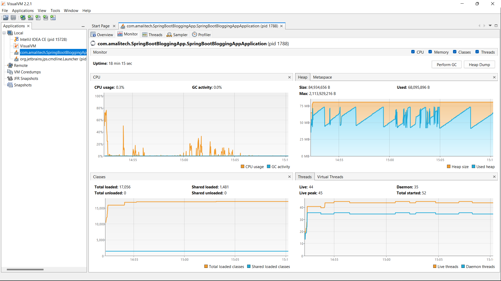

# API Performance & JVM Monitoring Report

**Application:** Spring Boot Blogging Application
**Testing Tools:** Postman and VisualVM
**Test Type:** Sequential Load Test (50 iterations per endpoint)

---

# 1. Introduction

This report presents performance and JVM resource utilization analysis for two REST endpoints:

* **Create Post**
* **Get Posts Sorted by Date**

API requests were executed using Postman (50 iterations each), while JVM metrics such as CPU, heap memory, threads, and class loading were monitored in VisualVM.

---

# 2. VisualVM Monitoring Screenshot

> 📌 Insert the VisualVM monitoring screenshot below.

**[Figure 1: VisualVM Monitor Tab showing CPU, Heap, Classes, and Threads during execution.]**

---

# 3. Test Results

---

## A. Create Post Endpoint

### Test Summary

* **Iterations:** 50
* **Total Duration:** 6s 155ms
* **Average Response Time:** 26ms

### Resource Utilization (VisualVM)

**CPU Usage**

* Average: **6.6%**
* Indicates efficient processing of write operations.

**Heap Memory**

* Heap Size: 84,934,656 B (~81 MB)
* Heap Used: 67,165,424 B (~64 MB)
* Moderate memory usage due to object creation and persistence.

**Threads**

* Live Threads: 45
* Daemon Threads: 36
* Stable thread behavior with no abnormal growth.

**Classes**

* Total Loaded: 15,972 → 16,989 (+1,017)
* Shared Loaded: 1,475 → 1,481
* Significant increase due to runtime class initialization during operations.

---

### Observations

* Very fast average response time (26ms).
* Low CPU usage compared to previous test cycle.
* Heap shows normal allocation pattern.
* Thread count stable, no evidence of leaks.
* Class loading increased significantly during operation.

---

## B. Get Posts Sorted by Date Endpoint

### Test Summary

* **Iterations:** 50
* **Total Duration:** 8s 558ms
* **Average Response Time:** 73ms

### Resource Utilization (VisualVM)

**CPU Usage**

* Average: **5.4%**
* Lower CPU consumption than Create Post.

**Heap Memory**

* Heap Size: 84,934,656 B (~81 MB)
* Heap Used: 51,529,888 B (~49 MB)
* Lower heap usage compared to Create Post.

**Threads**

* Live Threads: 44
* Daemon Threads: 35
* Slightly fewer threads than Create Post.

**Classes**

* Total Loaded: 17,053 → 17,056 (+3)
* Shared Loaded: 1,481 → 1,481
* Minimal class loading activity.

---

### Observations

* Slower response time (73ms) compared to Create Post.
* Very low CPU usage.
* Efficient memory handling.
* Stable class and thread behavior.

---

# 4. Comparative Analysis

| Metric             | Create Post | Get Posts (Sorted) | Analysis                |
| ------------------ | ----------- | ------------------ | ----------------------- |
| Avg. Response Time | 26ms        | 73ms               | Create Post faster      |
| Total Duration     | 6.15s       | 8.56s              | Read took longer        |
| CPU Usage          | 6.6%        | 5.4%               | Both low                |
| Heap Used          | ~64MB       | ~49MB              | Create uses more memory |
| Live Threads       | 45          | 44                 | Stable                  |
| Class Loading      | +1,017      | +3                 | Major difference        |

---

# 5. VisualVM Monitoring Analysis

### CPU Graph

* Short spikes during execution.
* No sustained high CPU consumption.
* GC activity remains minimal.

### Heap Graph

* Saw-tooth pattern visible.
* Indicates healthy garbage collection cycles.
* No continuous upward trend (no memory leak detected).

### Threads

* Live thread count fluctuated slightly but stabilized.
* No continuous increase.
* No deadlocks or thread starvation observed.

### Classes

* Noticeable class loading during Create Post.
* Minimal additional loading during Get Posts.
* No class unloading observed.

---

# 6. Performance Interpretation

1. **Create Post is optimized** in this test cycle, achieving very low response time (26ms).
2. **Get Posts Sorted by Date** shows slower performance (73ms), possibly due to:

   * Sorting operation
   * Database query complexity
   * Data volume
3. Both endpoints show **low CPU usage**, indicating efficient processing.
4. JVM memory management appears healthy with normal GC behavior.

---

# 7. System Health Evaluation

✅ Stable JVM behavior
✅ No memory leak indicators
✅ Stable thread management
✅ Efficient CPU usage
✅ Acceptable API response times

System performance is stable under moderate sequential load.

---

# 8. Recommendations

1. Test under concurrent user load to simulate real production traffic.
2. Analyze database indexing for the sorted query to improve read performance.
3. Enable detailed GC logging for deeper memory profiling.
4. Conduct stress testing to determine system breaking point.
5. Profile slow queries if read latency increases under scale.

---

# 9. Conclusion

The Spring Boot Blogging Application demonstrates:

* Strong write performance (26ms average)
* Acceptable read performance (73ms average)
* Stable CPU and memory utilization
* Healthy JVM lifecycle behavior

No critical performance issues were identified during this test cycle.
