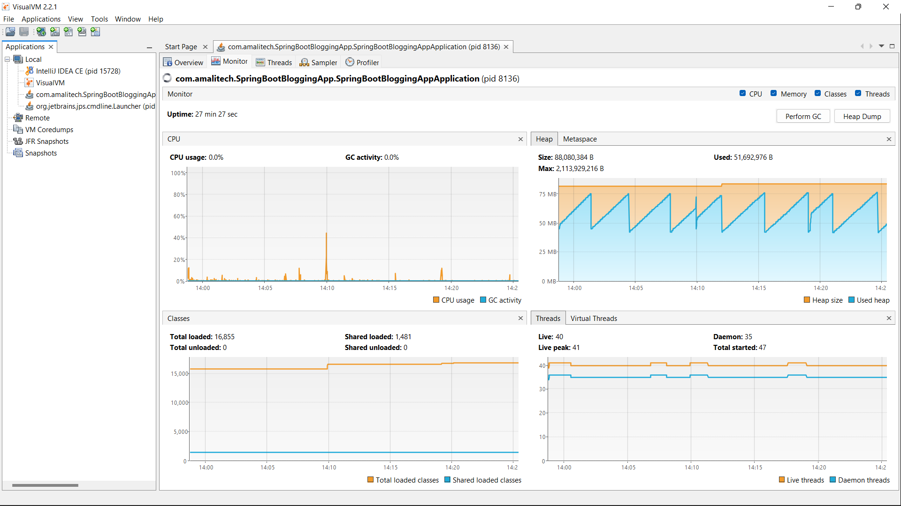

# API Performance & Resource Utilization Report

**Application:** Spring Boot Blogging Application
**Testing Tools:** Postman and VisualVM
**Test Type:** Functional Load Test (50 iterations per endpoint)

---

## 1. Introduction

This report presents the performance and JVM resource utilization analysis of two REST endpoints:

1. **Create Post**
2. **Get Posts Sorted by Date**

API requests were executed using Postman, while JVM performance metrics (CPU, Heap, Threads, Classes) were monitored using VisualVM.

---

# 2. VisualVM Monitoring Screenshot

**[Figure 1: VisualVM Monitor tab showing CPU usage, Heap memory graph, Threads, and Classes during test execution]**

---

# 3. Test Results

---

## A. Create Post Endpoint

### Test Summary

* **Iterations:** 50
* **Total Duration:** 8s 190ms
* **Average Response Time:** 62ms

### Resource Utilization (VisualVM)

**CPU Usage:**

* Average: **44.8%**
* Indicates higher processing due to write operation (validation + persistence).

**Heap Memory:**

* Heap Size: 85,983,232 B (~82 MB)
* Heap Used: 73,431,352 B (~70 MB)
* High usage compared to read endpoint, expected for object creation and database interaction.

**Threads:**

* Live Threads: 41
* Daemon Threads: 36
* No abnormal thread growth observed.

**Classes:**

* Total Loaded: 15,939 → 16,722
* Shared Loaded: 1,475 → 1,480
* Increase suggests dynamic class loading during request handling.

### Observations

* Stable response time (~62ms).
* CPU usage significantly higher than read endpoint.
* Memory utilization increased during execution but remained controlled.
* No thread leaks detected.

---

## B. Get Posts Sorted by Date Endpoint

### Test Summary

* **Iterations:** 50
* **Total Duration:** 7s 929ms
* **Average Response Time:** 61ms

### Resource Utilization (VisualVM)

**CPU Usage:**

* Average: **11.9%**
* Much lower than Create Post, expected for read operations.

**Heap Memory:**

* Heap Size: 88,080,384 B (~84 MB)
* Heap Used: 62,471,512 B (~59 MB)
* Lower heap usage compared to Create Post.

**Threads:**

* Live Threads: 41
* Daemon Threads: 36
* Thread count remained stable.

**Classes:**

* Total Loaded: 16,722 → 16,854
* Shared Loaded: 1,480 → 1,481
* Minimal class loading activity.

### Observations

* Slightly faster total execution time.
* Significantly lower CPU utilization.
* Efficient memory handling.
* Stable JVM behavior.

---

# 4. Comparative Analysis

| Metric             | Create Post | Get Posts (Sorted) | Analysis                         |
| ------------------ | ----------- | ------------------ | -------------------------------- |
| Avg. Response Time | 62ms        | 61ms               | Nearly identical                 |
| Total Duration     | 8.19s       | 7.93s              | Very similar                     |
| CPU Usage          | 44.8%       | 11.9%              | Create is ~4x more CPU intensive |
| Heap Used          | ~70MB       | ~59MB              | Higher for write operations      |
| Live Threads       | 41          | 41                 | Stable                           |
| Class Loading      | +783        | +132               | More activity during create      |

---

# 5. VisualVM Monitoring Analysis

From the VisualVM monitor:

### CPU Graph

* Short spikes during request execution.
* No sustained high CPU usage.
* GC activity remained minimal.

### Heap Graph

* Saw-tooth pattern observed.
* Indicates proper garbage collection cycles.
* No continuous upward trend (no memory leak detected).

### Threads

* Live threads stable around 40–41.
* No continuous thread growth.
* No thread starvation observed.

### Classes

* Gradual class loading increase.
* No class unloading observed.
* Stable runtime behavior.

---

# 6. Overall System Health Assessment

✅ Stable response times (<100ms)
✅ No memory leak symptoms
✅ Controlled garbage collection
✅ Stable thread management
✅ Expected CPU difference between read and write operations

The system performs efficiently under moderate sequential load (50 iterations).

---

# 7. Recommendations

1. Perform concurrent load testing (e.g., 200–1000 users).
2. Enable detailed GC logging for deeper memory analysis.
3. Profile database layer for optimization opportunities.
4. Consider stress testing using JMeter for real-world traffic simulation.
5. Monitor CPU usage under concurrent writes to evaluate scalability.

---

# 8. Conclusion

The Spring Boot Blogging Application demonstrates:

* Efficient API response times
* Proper JVM memory management
* Stable thread handling
* Expected resource consumption patterns

The **Create Post** endpoint consumes more CPU and memory due to write operations, while the **Get Posts Sorted by Date** endpoint remains lightweight and efficient.

No performance bottlenecks or JVM instability were detected during this test cycle.
